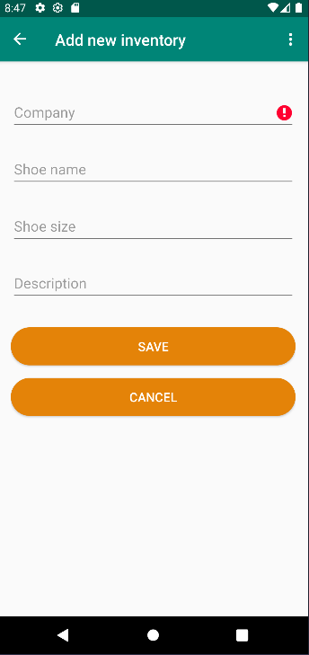

# Shoe Inventory app to explore Jetpack navigation

This project consists of five screens:

1. Login screen
    - A facade, any combination or even no input will advance to next screen
2. Welcome onboarding screen
    - A screen that is popped passed on the backstack (shows only 1 time)
3. Instructions onboarding screen
    - A screen that is popped passed on the backstack (shows only 1 time)
4. Shoe Listing screen
    - A screen that is updated through the ViewModel when a new Detail fragment is saved
5. Shoe Detail screen
    - A screen to input data for saving

## Jetpack features explored
- ViewModel, Databinding, Livedata
- NavGraph, NavController
- Safe Args

## Screenshots

